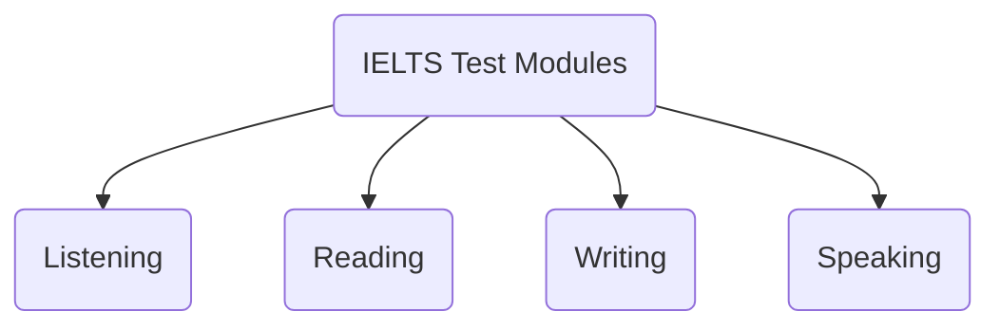

# IELTS-Prep

## Basic Grammar
Basic grammars are necessary to get started. Topics we should focus on are listed below.
- Parts of speech
- Tense
- Article
- Sentence Structure
- Voice
- Punctuation
- Degree

## Modules
There are four modules. 

1. ### Listening
|  Section  |  Description  |  Question Types  |
|  -------- |  --------     |   --------       |
| Section 1|A conversation between two people in a social or everyday context.|	- Form completion   - Multiple choice   - Matching   - Note completion|
|Section 2|A monologue set in an everyday social context (e.g., a speech about local facilities).|- Table completion   - Multiple choice   - Labeling a map/diagram   - Note completion|
|Section 3|A conversation between up to four people set in an educational or training context.|- Multiple choice   - Matching   - Plan/map/diagram labeling   - Sentence completion|
|Section 4|A monologue on an academic subject (e.g., a university lecture).|- Summary completion   - Multiple choice   - Note completion   - Sentence completion|
#### Question Types Explained:

1.  **Form completion:** Fill in the missing information in a form or table.
2.  **Multiple choice:** Choose the correct answer from a list of options.
3.  **Matching:** Match a list of items to a set of options.
4.  **Note completion:** Complete notes taken from the listening passage.
5.  **Table completion:** Fill in a table with information from the listening text.
6.  **Plan/map/diagram labeling:** Label parts of a map or diagram based on the listening text.
7.  **Sentence completion:** Complete sentences with words from the listening text.
8.  **Summary completion:** Complete a summary using words from the listening text.

2. ### Reading
| **Section** | **Description** | **Question Types** |
| ---- | ---- | ---- |
| **Passage 1** | A passage related to social survival (e.g., advertisements, timetables).|- Multiple choice   - True/False/Not Given   - Matching information   - Sentence completion|
|**Passage 2**| A work-related passage (e.g., job descriptions, training materials). | - Matching headings   - Multiple choice   - Note completion   - Summary completion |
| **Passage 3** | A longer, more complex passage on a general interest topic. | - List selection   - Matching features   - Diagram label completion   - Short-answer questions |

#### Question Types Explained:
1. **Multiple Choice:** Choose the correct answer from several options based on information in the passage.
2. **True/False/Not Given:** Determine if statements are true, false, or not given in the passage.
3. **Matching Information:** Match information or ideas to specific paragraphs or sections of the passage.
4. **Sentence Completion:** Complete sentences with words from the passage.
5. **Matching Headings:** Match headings to appropriate paragraphs or sections in the passage.
6. **Note Completion:** Fill in gaps in a set of notes using words from the passage.
7. **Summary Completion:** Complete a summary of the passage using words from a given list or from the passage itself.
8. **List Selection:** Select a number of items from a list based on the passage information.
9. **Matching Features:** Match a list of features to options based on details in the passage.
10. **Diagram Label Completion:** Label parts of a diagram based on information from the passage.
11. **Short-Answer Questions:** Answer questions using a specific number of words taken directly from the passage.

3. ### Writing
|Task|	Description	|Types of Writing Tasks|
|----|----|----|
|Task 1 (Academic)|	Describe visual information (e.g., graph, chart, table, diagram).	| - Describing trends   - Summarizing information   - Explaining a process|
|Task 1 (General Training)	|Write a letter based on a given situation (e.g., request information, explain a situation).|	- Formal letter   - Semi-formal letter   - Informal letter|
|Task 2|	Write an essay in response to a point of view, argument, or problem.	|- Opinion essay   - Discussion essay   - Solution essay   - Advantage/Disadvantage essay|

#### Question Types Explained:
1. **Describing Trends (Task 1 Academic):** Explain and summarize data presented in a graph, chart, or table, highlighting key trends and differences.
2. **Summarizing Information (Task 1 Academic):** Summarize and report the main features of a visual representation of information.
3. **Explaining a Process (Task 1 Academic):** Describe the stages of a process or how something works based on a diagram.
4. **Formal Letter (Task 1 General Training):** Write a formal letter in response to a given situation, using appropriate language and tone.
5. **Semi-formal Letter (Task 1 General Training):** Write a semi-formal letter to someone you know in a professional context, balancing formality and personal tone.
6. **Informal Letter (Task 1 General Training):** Write an informal letter to a friend or family member, using a casual and friendly tone.
7. **Opinion Essay (Task 2):** Write an essay expressing your opinion on a given topic, providing reasons and examples to support your view.
8. **Discussion Essay (Task 2):**
Discuss two opposing views on a topic and give your own opinion, supported by reasons and examples.
9. **Solution Essay (Task 2):** Identify a problem, suggest solutions, and evaluate the effectiveness of these solutions.
10. **Advantage/Disadvantage Essay (Task 2):** Discuss the advantages and disadvantages of a given issue or situation.

4. ### Speaking
|Part|	Description|	Types of Tasks|
| -------- | -------- | -------- |
|Part 1|	General questions about the candidate's life, hobbies, work, studies, etc.|	- Answering personal questions   - Providing simple descriptions|
|Part 2|	A long turn where the candidate speaks for 1-2 minutes on a given topic.	|- Describing an event, object, person, or place   - Giving a narrative|
|Part 3|	A discussion with the examiner on more abstract ideas and issues related to the Part 2 topic.	|- Analyzing and discussing ideas   - Speculating   - Justifying opinions|

#### Question Types Explained:
1. **Answering Personal Questions (Part 1):** Respond to questions about your life, work, studies, hobbies, etc., in a conversational manner.
2. **Providing Simple Descriptions (Part 1):** Describe everyday items, activities, or experiences briefly and clearly.
3. **Describing an Event, Object, Person, or Place (Part 2):** Speak for 1-2 minutes on a given topic, covering key points like what, where, when, and how.
4. **Giving a Narrative (Part 2)** Provide a detailed account or story related to the given topic, demonstrating fluency and coherence.
5. **Analyzing and Discussing Ideas (Part 3):** Engage in a deeper discussion on abstract ideas and issues related to the Part 2 topic, showcasing analytical skills.
6. **Speculating (Part 3):** Make predictions or hypothesize about future trends or scenarios related to the topic.
7. **Justifying Opinions (Part 3):** Provide reasons and evidence to support your opinions during the discussion.

## Literature
- [Cambridge IELTS Books 13-19](https://www.cambridge.org/us/cambridgeenglish/catalog/cambridge-english-exams-ielts/ielts)
- [Makkar IELTS for Speaking](https://makkarielts.com/)
- [IELTS Liz](https://www.youtube.com/user/ieltsliz)
